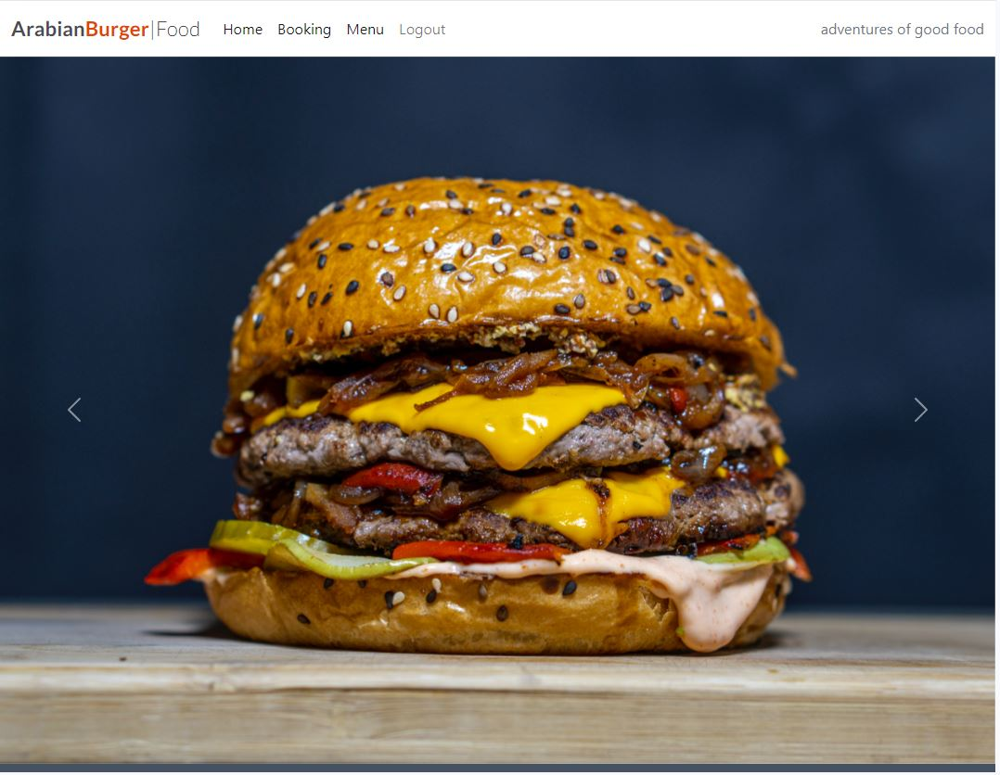
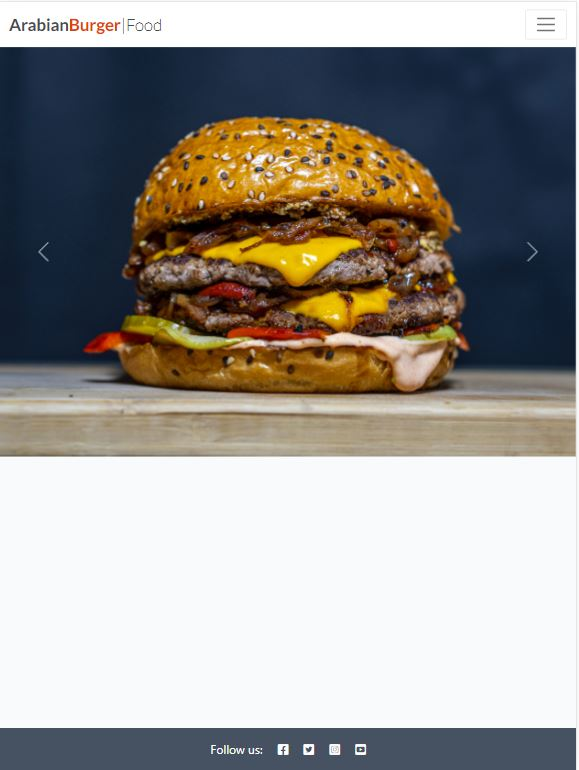
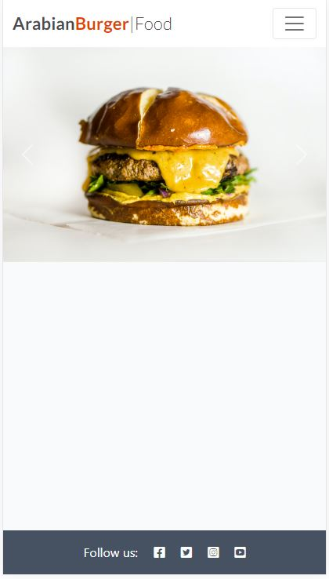
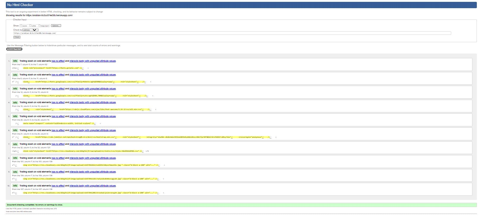
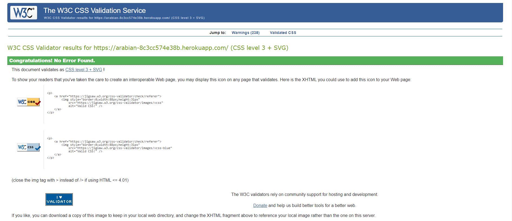
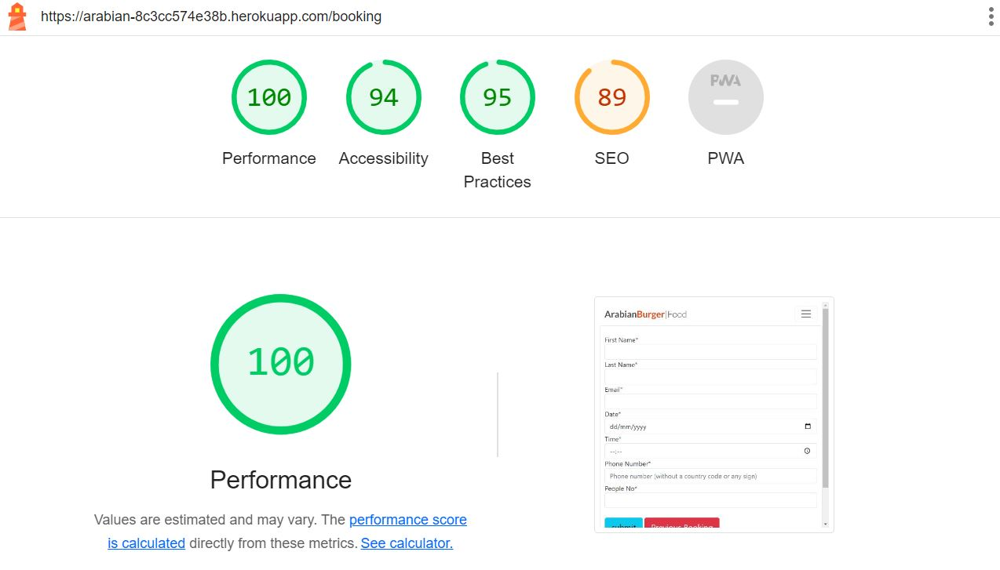
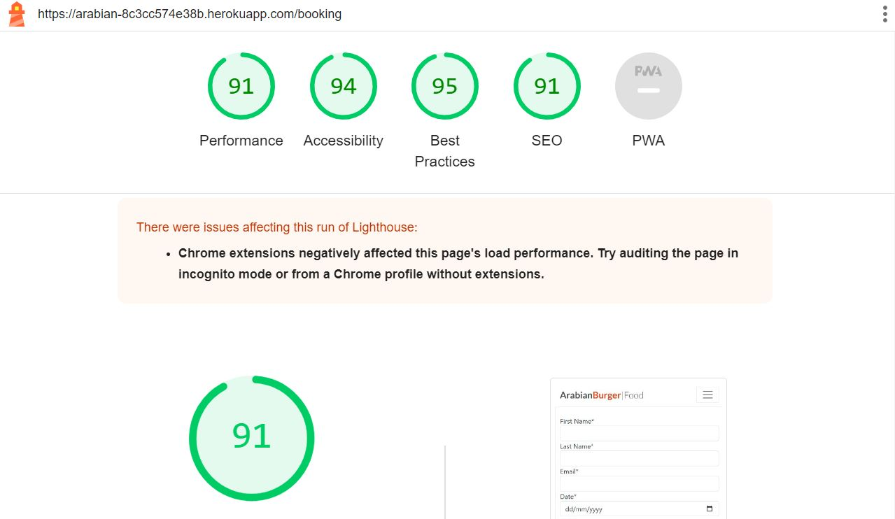

# The Arabian Burger -  Testing
## Desktop View

## Ipad View

## Mobile View 

 

Visit the deployed site: [The Arabian Burger](https://arabian-8c3cc574e38b.herokuapp.com/)

- - -

## CONTENTS

- [The Arabian Burger -  Testing](#the-arabian-burger----testing)
  - [Desktop View](#desktop-view)
  - [Ipad View](#ipad-view)
  - [Mobile View](#mobile-view)
  - [CONTENTS](#contents)
  - [AUTOMATED TESTING](#automated-testing)
    - [W3C Validator](#w3c-validator)
    - [CI Python Linter Validator](#ci-python-linter-validator)
    - [Lighthouse](#lighthouse)
    - [Desktop Results](#desktop-results)
    - [Mobile Results](#mobile-results)
  - [MANUAL TESTING](#manual-testing)
    - [Testing User Stories](#testing-user-stories)
    - [Full Testing](#full-testing)

Testing was ongoing throughout the entire build. I utilised Chrome developer tools whilst building to pinpoint and troubleshoot any issues as I went along.

During development I made use of google developer tools to ensure everything was working correctly and to assist with troubleshooting when things were not working as expected.

I utilised the console in the developer tools to work through small sections of JavaScript and ensure that the code was working, and also to troubleshoot where issues were.

I have gone through each page using google chrome developer tools & Firefox inspector tool to ensure that each page is responsive on a variety of different screen sizes and devices.

- - -

## AUTOMATED TESTING

### W3C Validator

[W3C](https://validator.w3.org/) was used to validate the HTML on all pages of the website. It was also used to validate the CSS.

  

 

- - -

### CI Python Linter Validator

[PEP8](https://pep8ci.herokuapp.com/#) was used to validate the Python.

  

- - -

### Lighthouse

I used Lighthouse within the Chrome Developer Tools to test the performance, accessibility, best practices and SEO of the website.

### Desktop Results

All pages of the site are achieving a score of 90 across the 4 categories.

### Mobile Results

Each page is achieving a score of 95 for the last three categories. 

- - -

## MANUAL TESTING

### Testing User Stories

`First Time Visitors`

| Goals | How are they achieved? |
| :--- | :--- |
| I want to make a booking at the restaurant. | By clicking on making a booking tab, that will allow user to display booking form |
| I want to see my pervious bookings| By clicking on my booking tab, that will display all user pervious bookings|
| I want to see Menu | By clicking the Menu Button at the nav bar, that allow the user to display the whole restaurant menu to choose what he prefer to eat |
| I want to logout | By clicking the logout Button at the nav bar, the users will be able to logout the site  |

`As a Manager `

| Goals | How are they achieved? |
| :--- | :--- |
| I want to be able to see all the bookings made by any user | By clicking the all booking button, it will display the all the bookings that are made by all the users |
| I want to be able to approve the booking | By clicking the approve button, it will display the approve form to approve the booking |
|As a manager, I want to edit the bookings| by clicking the edit button, the display form will show the booking details allowing to edit the booking|
|As a manager, I want to be able to delete the booking | by clicking the delete button i can delete the choosen booking|

- - -

### Full Testing

Full testing was performed on the following devices:

* Laptop:
  * Macbook Pro 2021 14 inch screen
* Mobile Devices:
  * iPhone 13 pro.
  * iPhone 11 pro.
  * Phone X.

Each device tested the site using the following browsers:

* Google Chrome
* Safari
* Firefox

Additional testing was taken by friends and family on a variety of devices and screen sizes. They reported no issues when playing.

One tester in peer code review stated that the bottom of the play screen was cut off when testing on an iphone SE (2nd gen). I was unable to replicate this issue using google chrome developer tools.

`Home Page`

| Feature | Expected Outcome | Testing Performed | Result | Pass/Fail |
| --- | --- | --- | --- | --- |
| The Sites title | Link directs the user back to the home page | Clicked title | Home page reloads | Pass |
| Make a booking button | Displays the form to make the booking | Clicked on button | Form with all the required fields | Pass |
| Menu button | Display the whole menu | Clicked on Menu button | Shows Menu | Pass |
| My Bookings Button | Directs the user to the previous bookings | Clicked on button | Previous bookings displayed  | Pass |
| Logout Button | Directs the user to the Logout page | Clicked on button | Directs to the logout page | Pass |

`Booking Page `

| Feature | Expected Outcome | Testing Performed | Result | Pass/Fail |
| --- | --- | --- | --- | --- |
| The Sites title | Link directs the user back to the home page | Clicked title | Directed back to home page | Pass |
| Submit button| Submit the form after filling the required info | Clicked button | Submit the form, creating a booking | Pass |

`Menu Page`

| Feature | Expected Outcome | Testing Performed | Result | Pass/Fail |
| --- | --- | --- | --- | --- |
| The Sites title | Link directs the user back to the home page | Clicked title | directed back to home page | Pass |

`Booking Details Page`

| Feature | Expected Outcome | Testing Performed | Result | Pass/Fail |
| --- | --- | --- | --- | --- |
| The Sites title | Link directs the user back to the home page | Clicked title | Home page reloads | Pass |
| Edit button | direct the user to the edit page | Click button | Display Edit form | Pass|
|Delete Button |  display the delete form | Clicked button  | Display the delete form | Pass |

`Edit Page`

| Feature | Expected Outcome | Testing Performed | Result | Pass/Fail |
| --- | --- | --- | --- | --- |
| The Sites title | Link directs the user back to the home page | Clicked title | Home page reloads | Pass |
| Confirm Edit button | Update the booking data after modifying  | Clicking button | Confirm the update of the modified data | Pass |

`Delete Page`

| Feature | Expected Outcome | Testing Performed | Result | Pass/Fail |
| --- | --- | --- | --- | --- |
| The Sites title | Link directs the user back to the home page | Clicked title | Home page reloads | Pass |
| Confirm Delete button |  delete the booking | Clicked button | confirm the delete of the booking | Pass |

